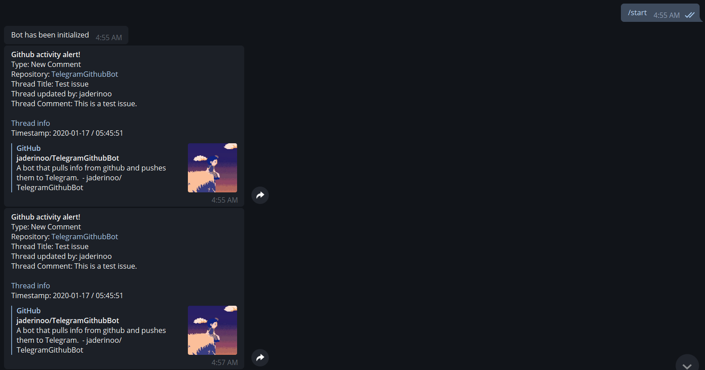

# TelegramGithubBot
A bot that pulls info from github and pushes them to Telegram using python3.

# Currently the bot sends:
- Push
- Pulls
- Issues
- Branch Creation
- Branch Deletion
- Comments

# Usage 
- Download and install the Telegram.ext from https://github.com/python-telegram-bot/python-telegram-bot
  - ```sudo pip3 install python-telegram-bot```

- Install Flask ```sudo pip3 install flask```

- (Optional) Install ngrok to recieve webhooks
  - Run ```screen``` to allow ngrok usage in the background.
  - Run ```ngrok http (Port)```
  - Make sure to start another screen for the main instance
  
- Set the tunnel url on the Github webhooks page (Found in repo settings)

- Move to directory and use: ```sudo nano keys.py``` (Replace required keys and add aditional tunnel information if necessary).
  - This bot requires the use of Content type: appliation/json

- Run ```sudo python3 main.py```

- The bot will then wait for the command /start from the desired chat

- Once the bot recieves the command it will start listening for Github webhooks

# Commands
/Start - Starts the bot and searches for new tweets from the ID list

# Depiction

